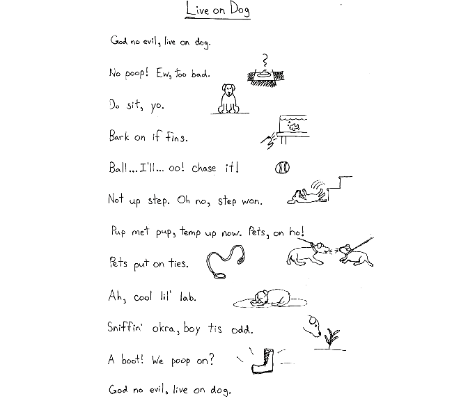
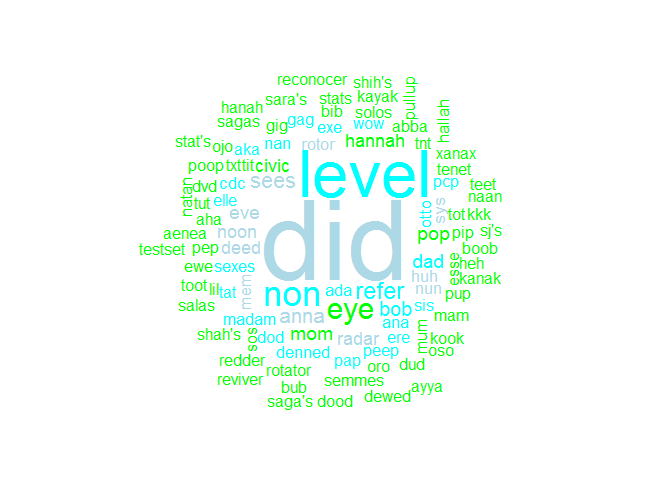
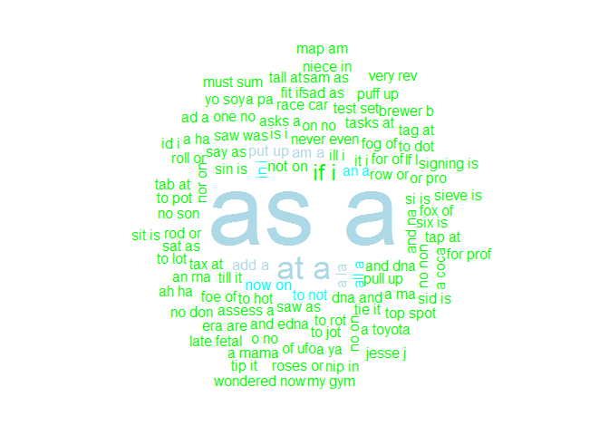
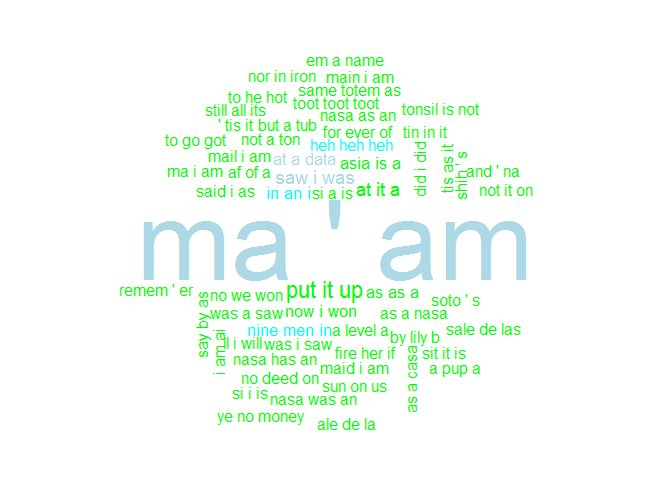
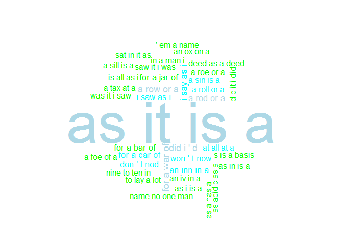

Palindrome Ngrams
================
Cooper Schumacher
November, 2017

| **Primary skills**                 | **Primary Programs**          |
|------------------------------------|-------------------------------|
| Big Data Querying and Manipulation | Apache Hadoop/Hive/Spark, AWS |

Background and Objective
========================

A palindrome is a word or phrase that is spelled the same forwards and backwards. I occasionally like coming up with my own palindromes (see my favorite below), and decided to produce a list of commonly used palindromes extracted from the Google Ngrams dataset.

-   **Objective:** Come up with lists of 1, 2, 3, 4 and 5 word palindromes commonly used in the English language, and a method of ordering the lists by how common the phrase is.

<br>


<p class="caption">
A Palindrome I created in 2015
</p>

<br>

Ngrams Dataset
==============

The Google [Ngrams](https://books.google.com/ngrams) dataset tracks how frequently words and phrases occur in books over time. These datasets are publically available on Amazon Web Services S3 and described [here](https://aws.amazon.com/datasets/google-books-ngrams/) . For our purpose we are interested producing a list of words/phrases by taking a cross-section of the ngram data, rather than looking at longitudinal changes in the frequency of one or a few words/phrases.

### Data Format

There are 5 separate datasets (1, 2, 3, 4 and 5 grams) with a combined size of 318 GB. There are also other languages, but I only considered English.

Variables:

-   *n-gram*
-   *year*
-   *occurrences* during the year
-   *pages* the n-gram appeared on during the year
-   *books* the n-gram appeared in during the year

### Advantages of the Dataset

Anyone who has attempted to write a palindrome knows that it is very challenging to string together words that flow and make any sense. The Google Ngrams dataset is ideal for addressing these issues for a few reasons:

-   **It comes from actual text in books.** Rather than taking words from a dictionary and randomly permuting them into ngrams, the strings are from actual texts and more likely to make sense. Words and phrases that wouldn't appear in a dictionary are also included for this reason. However, this also means that we need to weed out more strings that aren't actual words or phrases.
-   **We can quantify how common the word/phrase is.** By using the number of occurrences, we are able to order the palindromes by usage frequency.

<br>

Data Querying and Cleaning
==========================

I used Amazon Web Service's Elastic MapReduce (EMR) service to create a cluster and run Apache Hive to query the ngram dataset. I also wrote similar Spark code using Pyspark and the SQL library but there was not a large difference in run time.

My scripts produced output files with two columns:

-   The palindrome ngrams
-   The cumulative occurrences (over a ten year period)

### Cleaning

I removed ngrams with:

-   Special characters or numbers
    -   However, apostrophes were kept to allow for contractions (e.g. "don't nod")
-   Only single characters in each gram (e.g. "A", or "I I")
-   Year outside of 1990 to 2000
    -   I chose a ten year range to sufficiently capture words that don't occur often but also limit the size of the dataset to avoid unnecesary query time.

I also made all ngrams lowercase to combine ngrams of the same word (e.g. "DID", "Did" and "did" all become "did").

### Determining whether a string is a palindrome

I used the following code to determine whether a string was a palindrome, which tests whether the (lowercase) string with spaces and apostrophes removed is the same forwards and backwards. That is,

``` python
regexp_replace(gram,'\'| ','')= REVERSE(regexp_replace(gram,'\'| ',''))
```

-   I removed spaces to allow for multiple word palindromes (e.g. "If I").
-   I removed apostrophes to allow for contractions (e.g. "Sara's").

<br>

The Palindrome Lists
====================

**From the 318 GB Ngrams dataset we produced a small list of 307 palindromes.**

-   Even with the restrictions of the query, the lists required some (minimal) further cleaning. For example, strings of repeated letters (e.g. "xxxxxxxxxx", "ii iii"), repeated ngram palindromes (e.g. "did did did") or ngrams with an illogical apostrophe (e.g. " ' did") were occasionally included. I preferred this extra cleaning rather than add extra restrictions (e.g. minimum number of occurrences) which would remove potentially interesting palindromes that just aren't used often.

### Word clouds

Below are word clouds of the 1, 2, 3, 4 and 5 grams with size proportional to usage frequency. Note that apostrophes were considered their own gram, which is why a word like "ma'am" is considered a 3gram. We produced less results for the higher values of n, and only three different 5grams (after cleaning), including the famous [Sator Square](https://en.wikipedia.org/wiki/Sator_Square).










Hive Script
===========

Below is the query code for producing the output for 2gram palindromes. A similar script was used for the other ngrams.

### Access the data on AWS S3

We accessed the dataset with the desired language and value of *n* (English 2grams).

``` python
set lang = eng-us-all;
set gram = 2gram ;

CREATE EXTERNAL TABLE IF NOT EXISTS ngrams (
gram string,
year int,
occurrences bigint,
pages bigint,
books bigint
)
ROW FORMAT DELIMITED FIELDS TERMINATED BY '\t'
STORED AS SEQUENCEFILE
LOCATION 
's3://datasets.elasticmapreduce/ngrams/books/20090715/${hiveconf:lang}/${hiveconf:gram}/';
```

### Clean Data

We create a new table with the ngram and cumulative occurrences between 1990 and 2000. We convert each ngram to lowercase to combine words with difference cases. We also remove ngrams that include characters other than letters, apostrophes and spaces (e.g. numbers and special characters).

``` python

CREATE EXTERNAL TABLE IF NOT EXISTS cleaned (
gram string,
cumoccurrences bigint);

INSERT OVERWRITE TABLE cleaned
SELECT LOWER(gram), SUM(occurrences) FROM ngrams 
WHERE 
year >= 1990 AND year < 2000 
AND gram REGEXP '^[A-z\' ]+$'  
GROUP BY LOWER(gram);
```

### Produce palindrome output

We set our output text file (with palindrome ngram and cumulative occurrences) to go into the desired bucket on AWS S3. To determine whether an ngram is a palindrome, we first use *regexp\_replace()* to remove apostrophes and spaces, and then compare the resulting string to the *REVERSE()* of the string. This allowed us to produce palindromes with contractions such as "don't nod". We remove ngrams with only *n* length (after spaces/apostrophes are removed) to avoid ngrams such as "I I". Finally, we ordered the table so that the top entries are the most frequently used ngrams.

``` python

set outputbucket=s3n://ngrampalindrome/output/twogram;

CREATE TABLE IF NOT EXISTS palindromengrams (
palindromengram string,
cumoccurrences bigint)
ROW FORMAT DELIMITED FIELDS TERMINATED BY '\t'
STORED AS TEXTFILE
LOCATION '${hiveconf:outputbucket}';

INSERT OVERWRITE TABLE palindromengrams 
SELECT gram, cumoccurrences FROM cleaned 
WHERE LENGTH(regexp_replace(gram,'\'| ',''))>2 
AND regexp_replace(gram,'\'| ','')= REVERSE(regexp_replace(gram,'\'| ','')) 
ORDER BY cumoccurrences DESC;
```

<br>

Spark Code
==========

I also tried the following code in Spark. However, runtimes did not receive significant improvement (which was not surprising for the tasks being executed).

``` python
from pyspark.sql import SparkSession
from pyspark.sql import Row
from pyspark.sql.functions import col
import re

# Create a SparkSession 
spark = SparkSession.builder.appName("PalindromeQuery").getOrCreate()

#Mapper to convert to row object
#Note: remove all characters besides letters and spaces and make lowercase
def mapper(line):
    fields= line.split("\t") 
    return Row(ngram=str(re.sub("[^A-z ]", '',fields[0]).encode("utf-8").lower()), year=int(fields[1]), occur=int(fields[2]))

#Access data and convert into row object format
lines = spark.sparkContext.sequenceFile("s3://datasets.elasticmapreduce/ngrams/books/20090715/eng-us-all/2gram/data")
stringlines=lines.map(lambda x: x[1])
gramsdf = stringlines.map(mapper)

#Filter by year (1990-2000)
filtered=gramsdf.filter( lambda x: x['year']>=1990 and x['year']<2000)

#Create data frame and table to query
df= spark.createDataFrame(filtered).cache()
df.createOrReplaceTempView("df")

#Query based on if palindrome, and aggregate to find sum of occurrences
#Note: ignore 2grams with length 2 and order by occurrences
palindromes = spark.sql("SELECT ngram, SUM(occur) FROM df WHERE LENGTH(REGEXP_REPLACE(ngram,' ',''))>2 AND REGEXP_REPLACE(ngram,' ','')==REVERSE(REGEXP_REPLACE(ngram,' ','')) GROUP BY ngram ORDER BY SUM(occur) DESC")


#Save file to single csv file in desired output bucket
palindromes.coalesce(1).write.csv("s3://palindromengram/output/twogram.csv")

spark.stop()
```
